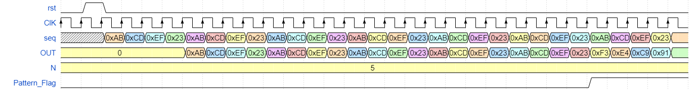

# PRBS-15 Block and Pattern Detector

## Blocks Description

- the first block (PRBS-15 Block) takes an input pattern (seq) of 4 bytes and takes an input n , the function of this block to output each byte from pattern in one clock cycle then repeat the pattern n times after finishing repeating the pattern the out will be random according to SHIFT_REG that takes a seed when activate rst and when finishing repeating the pattern SHIFT_REG will be shifted left by one bit and SHIFT_REG[0] = SHIFT_REG[14] ^ SHIFT_REG[13] and out[0] = SHIFT_REG[0] , out[7:1] = SHIFT_REG[11:5].

- the second block (Pattern Detector) takes an input out_PRBS that is the output of first block and takes an input n_detec , the function of this block to compare between out_PRBS and the pattern and check if the out_PRBS equal first byte of the pattern then second byte of the pattern till reach the fourth byte then repeat this process n_detec times if this process matches the output Pattern_Flag raises to 1 else if the pattern doesn't match out_PRBS Pattern_Flag becomes 0.

## The expected Waveform

## The schematic of archeticture

## The simulation Waveform

- in the first test case i send the right pattern = 32'hABCDEF23 and repeats it 5 times and waits for Pattern_Flag to become 1 , 
after this the output will be random.

- in the second test case i send the wrong pattern = 32'hABBDEF23 and repeats it 3 times and waits for Pattern_Flag to become 1 but Pattern_Flag = 0 due to the wrong pattern input, after this the output will be random.

# FPGA Impelementation

- our design will be used on Zybo z7 FPGA kit provided by digilent.inc . the design uses the FPGA system clock and divides it to the operation clk , which will be 200 ns.

## Design Constraints

- it is required to write all the constraints to enable the bitstream to be generated.

## Design Elaboration
- It is required to run Elaboration after setting the block diagram and the constraints file that will generate the elaboration block diagram.

## Design Synthesis

- After that we will run the synthesis and generate the utilization and power summaries.

## Design Impelementation

- for now our design is ready for the impelementation , which will place the components on the FPGA (Plac & Route).

- Our Design meets all specification timing constraints and no violation will occur.

- Finally we will generate the bitstream.

